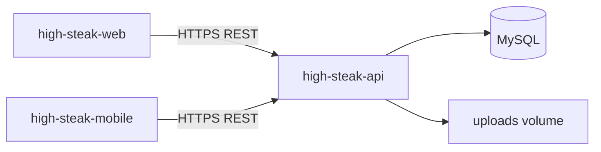
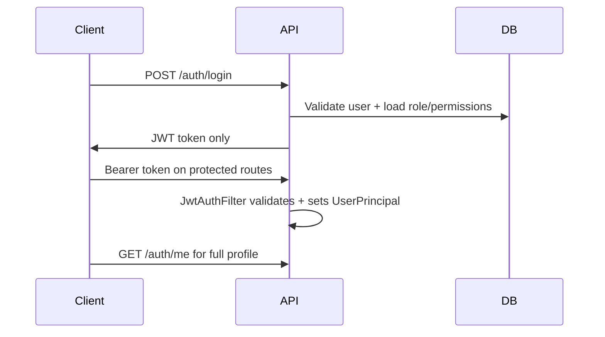

# High Steak Architecture

## System overview



Three clients share one REST API. Auth is JWT-based; authorization uses DB-backed roles and scopes.

## URL layout

| URL | Handler |
|-----|---------|
| `http://localhost:8080/` | Tomcat root welcome page (HTML/JSON) |
| `http://localhost:8080/api/` | Redirects to Swagger UI |
| `http://localhost:8080/api/*` | Spring Boot app (context path `/api`) |
| `http://localhost:8080/api/swagger-ui.html` | OpenAPI / Swagger UI |
| `http://localhost:8080/api/uploads/**` | Static uploaded images |

Spring Security matchers are **servlet-relative** (no `/api` prefix in Java code).

## API layers

```
controller → service → repository → domain (JPA entities)
                ↓
              dto (request/response records)
```

- Controllers: HTTP mapping, validation, `@PreAuthorize`
- Services: business logic, transactions
- Repositories: Spring Data JPA
- DTOs: Java records in `com.highsteak.api.dto`

## Authentication flow



JWT claims include: `sub` (username), `uid`, `email`, `displayName`, `avatarUrl`, `roles`, `scopes`.

Login/register responses do **not** include a user object — web parses the token via `parseUserFromToken()` in `client.ts`.

## RBAC model

| Concept | Storage | Usage |
|---------|---------|-------|
| Role | `roles` table (`USER`, `MODERATOR`, `ADMIN`) | One role per user via `users.role_id` |
| Permission | `permissions` table (scope strings) | e.g. `posts:write`, `users:manage` |
| Role-permission | `role_permissions` | Many-to-many |
| Scope | Derived at login | Stored in JWT; checked via `@PreAuthorize("hasAuthority('...')")` |

`PermissionService` loads scopes for a role from the database — no hardcoded enum mappers.

### Resource-level authorization

`ResourceAuthorizationService` + `ResourceOwnerResolver` implementations (e.g. `PostsOwnerResolver`) support expressions like:

```java
@PreAuthorize("@resourceAuth.can('posts', #id, 'delete', 'delete', authentication)")
```

## Database migrations

Flyway versions in `src/main/resources/db/migration/`:

| Version | Description |
|---------|-------------|
| V1 | Initial schema (users, steak_posts) |
| V2 | User role column, posts.hidden |
| V3 | RBAC tables + permission seeds |
| V4 | User UUID migration (Java, registered in `FlywayConfig`) |

JPA uses `ddl-auto: validate` — never rely on Hibernate to alter production schema.

## Web app

- **Routing**: React Router 7
- **Auth**: `AuthContext` — token in localStorage, user from JWT parse + optional `getMe()` refresh
- **Gates**: `hasRole`, `hasScope`, `RoleGate`, `ProtectedRoute`
- **API**: All HTTP via `src/api/client.ts`; base URL from `VITE_API_URL`

## Mobile app

- Flutter with `http` client
- `apiBaseUrl` in `lib/config/api_config.dart` must end with `/api`
- Paths are servlet-relative (`/auth/login`, `/posts`)

## OpenAPI

Canonical contract: `apps/high-steak-api/openapi/openapi.yaml`. SpringDoc serves live docs at `/swagger-ui.html` under the API context.
